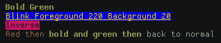

# PHP Chalk

A PHP terminal styling library inspired by [Chalk](https://github.com/chalk/chalk)

## Features

-   Support 16 colors, 256 colors and Truecolor (16m colors) mode.
-   Support style chaining.
-   Support style nesting.

## Usage

See `examples` to know more about how to use this library.

```php
print $chalk->bold->green("Bold Green");
print "\n";
print $chalk->underscore->color220->bgColor20("Blink Foreground 220 Background 20");
print "\n";
print $chalk->rgb(200, 20, 100)->inverse("Inverse");

// Style nesting
print $chalk->red("Red then", $chalk->bold->green("bold and green then"), $chalk->reset("back to normal\n"));
```

**Screenshot**:




## API

### **`$chalk-><style>[-><style>...](string, [string...])`**

_Example_: `$chalk->bgGreen->red->bold('Background green red bold text')`

### **`$chalk->hasColorSupport(), $chalk->has256Support(), $chalk->has16mSupport()`**

Return true if the corresponding feature is supported.

## Styles supported

-   `reset`, `bold`, `dim`, `underscore`, `italic`, `strikethrough`, `blink`.
-   `red`, `green`, `yellow`, `blue`, `magenta`, `cyan`, `white`
-   `lightGray`, `darkGray`, `lightRed`, `lightGreen`, `lightYellow`, `lightBlue`, `lightMagenta`, `lightCyan`
-   Each of the color styles above with the prefix `bg`

## Contribute

Feel free to contribute by forking or making suggestions.
